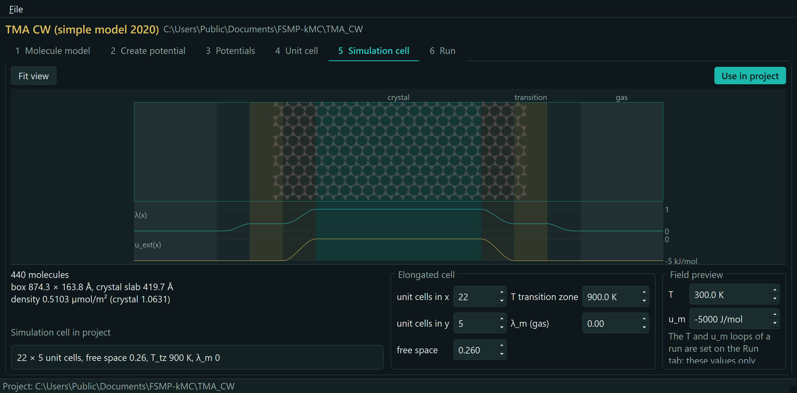
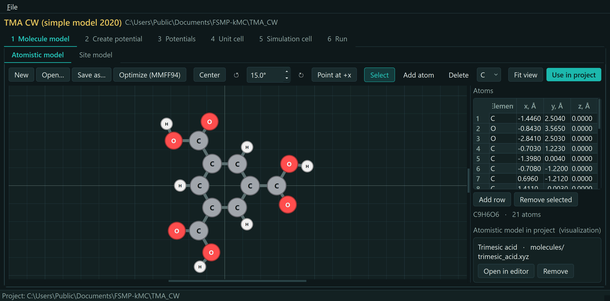
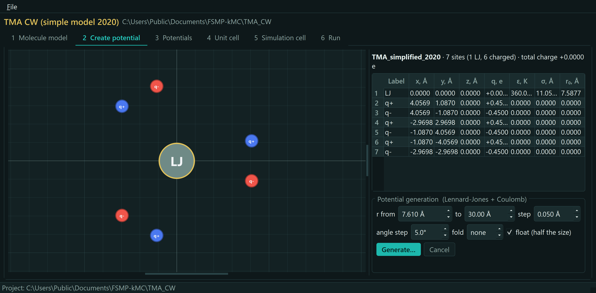
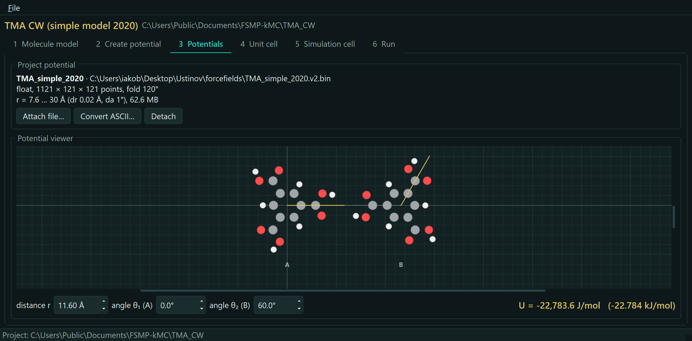
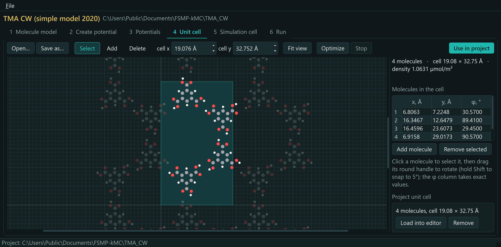
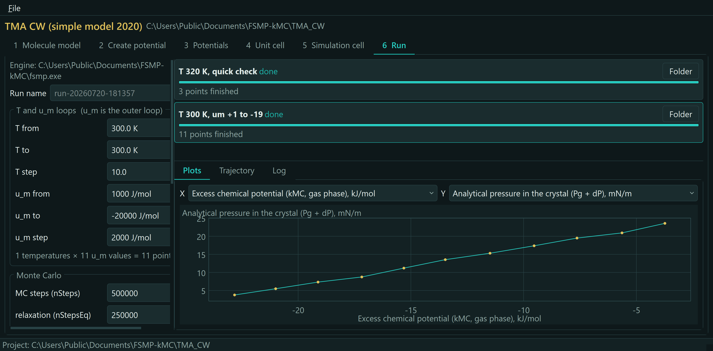
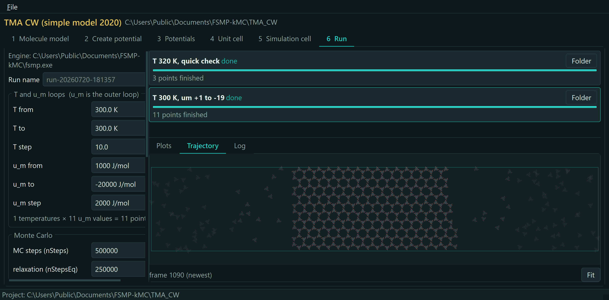
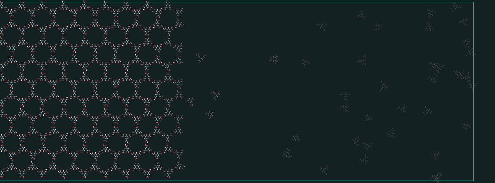

<p align="center">
  <picture>
    <source media="(prefers-color-scheme: dark)" srcset="logo/logo-dark.svg">
    <source media="(prefers-color-scheme: light)" srcset="logo/logo.svg">
    
  </picture>
</p>

# FSMP-kMC

[](https://github.com/iakobian/fsmp-kmc/actions/workflows/ci.yml)

**Field-Stabilized Multiphase kinetic Monte Carlo.** A kinetic Monte Carlo
engine for the atomistic thermodynamics of rigid molecular crystals and
two-dimensional adsorption layers.

The code simulates two coexisting phases (a crystal and an ideal-gas reservoir)
in a single elongated cell. Two imposed inhomogeneous fields, a *damping* field
and an *external* field, stabilize this coexistence over a wide range of
temperature and pressure. This makes it possible to determine the free energy,
entropy and chemical potential of dense molecular layers from the equality of
chemical potentials in the coexisting phases.

<p align="center">
  <a href="docs/screenshots/5-simulation-cell.png"></a>
</p>
<p align="center"><em>The method in one picture (FSMP-kMC Studio): the elongated
cell holds a crystal slab and a gas reservoir; the damping field λ(x) and the
external field u<sub>ext</sub>(x) stabilize their coexistence.</em></p>

## Method

This code accompanies the following study:

> S. S. Akimenko, V. A. Gorbunov and E. A. Ustinov, *Equilibrium structure of a
> dense trimesic acid monolayer on a homogeneous solid surface: from atomistic
> simulation to thermodynamics*, *Phys. Chem. Chem. Phys.*, 2023, **25**,
> 31352–31362. <https://doi.org/10.1039/D3CP03955B>

The method was originally introduced as *Fields-supported MultiPhase kinetic
Monte Carlo (FsMP/kMC)*.

## Requirements

- A C++ compiler (clang++ is recommended).
- A numerical forcefield (potential) file. See [Forcefields](#forcefields).
- Python 3 for the regression tests; with numpy and matplotlib it also
  runs the optional post-processing script in `xyz_modification/`.

## Building and running

The program is built once and reads all simulation parameters from a text file
at run time. The files in `configs/` are ready-to-run examples that document
every key; use one as a template for your own system.

```bash
make
./fsmp.out configs/tma_acid_hcp.txt
```

Or compile directly, which is all the Makefile does:

```bash
clang++ -O3 fsmp.cpp -o fsmp.out
```

On Windows, `make windows` builds native static `fsmp.exe` and `pack.exe`;
it needs a MinGW g++ on `PATH`
([w64devkit](https://github.com/skeeto/w64devkit) is a portable
single-archive toolchain; MSYS2 works too). With w64devkit unpacked to
`C:\w64devkit` (or pointed to by `W64DEVKIT`), `build.cmd` wraps it all
without touching `PATH`: `build` compiles the engine, `build test` runs
the test suite, `build bundle` assembles the release bundle.

Paths inside a parameter file are relative to the directory the program is
started from (the examples expect the repository root), and all output files
are written there.

### Ready-made builds (no compiler, no Python)

Every [release](https://github.com/IakOBiaN/fsmp-kmc/releases/latest) ships a
self-contained bundle per platform (Windows, Linux, macOS): the FSMP-kMC
Studio desktop app, the engine and converter binaries, example configs and
the bundled molecule models and unit cells. Download the archive for your
system, unpack it, put the downloaded potentials into its `forcefields/`
folder and start the Studio (`FSMP-kMC Studio.exe` on Windows), or run the
engine from the command line:

```
fsmp.exe configs\tma_acid_hcp.txt
```

Working with a release does not require the source code. The binaries are
not code-signed (usual for academic software): on the first launch of a
downloaded copy Windows SmartScreen may warn about an unrecognized app
(More info → Run anyway) and macOS requires right-click → Open. Every
release also carries a `SHA256SUMS.txt`; verify a download with
`sha256sum -c --ignore-missing SHA256SUMS.txt`. The Linux
bundle runs on Ubuntu 22.04 or newer (glibc 2.35+); the engine binary
itself is static and runs anywhere. For development, the same layout works inside
the repository: `fsmp.exe` or `fsmp.out` in the repository root is picked
up by the GUI automatically.

## GUI: FSMP-kMC Studio

A desktop workbench (`gui/`, PySide6) that covers the whole workflow:
molecule models (with MMFF94 geometry optimization of a hand-built
molecule), potential generation and conversion, unit-cell optimization with
a live animation, the simulation cell, and production runs that are started
detached, with live progress, statistics plots and a trajectory viewer.

|  |  |
| :---: | :---: |
| *1 · Molecule model — the atomistic molecule and the site model* | *2 · Create potential — sweep the model into a numerical potential* |
|  |  |
| *3 · Potentials — probe the attached grid at any dimer geometry* | *4 · Unit cell — build and optimize the crystal cell* |
|  |  |
| *6 · Run — detached production runs, live statistics plots* | *6 · Run — the trajectory viewer on the two-phase cell* |

And this is what a run looks like up close — the trajectory viewer zoomed
to a crystal–gas interface of the TMA monolayer, over a sweep of the
external field:

<p align="center">
  
</p>
<p align="center"><em>Molecules leave and rejoin the hydrogen-bonded
lattice; the damping field fades them out as they cross into the
ideal-gas reservoir.</em></p>

<sub>Tab 5, the simulation cell, is the picture at the top of this README.
All stills and the animation are rendered straight from the application,
on the bundled sample project.</sub>

Every release ships the Studio as a ready-made app (see
[Ready-made builds](#ready-made-builds-no-compiler-no-python)); the
following runs it from source. It runs natively on Windows, Linux and
macOS; the setup is the same everywhere:

```bash
python3 -m venv gui/.venv          # Windows: py -3 -m venv gui\.venv
gui/.venv/bin/pip install -e gui   # Windows: gui\.venv\Scripts\pip install -e gui
gui/.venv/bin/fsmp-gui             # Windows: gui\.venv\Scripts\fsmp-gui
```

The GUI drives the same engine binary as the command line and resolves it
in this order:

1. the `FSMP_ENGINE` environment variable (full path to a binary);
2. `fsmp.exe` or `fsmp.out` in the repository root: a release download or a
   local build;
3. `fsmp` on `PATH`.

The Run tab shows which engine it found. Closing the GUI never kills
running simulations; they are recovered from their run folders on the next
start.

## Forcefields

The intermolecular interaction is supplied as a precalculated *numerical
potential*. Ready-to-use potentials in the compact binary format (v2) are read by
the program directly; download and unpack them into the `forcefields/` folder:

[Download numerical forcefields (binary, v2)](https://1drv.ms/f/c/18917b5147a88b6c/IgC8SnvBaZORTYWhHGeVLxWQAUzqPePWJhDM3ah1dJotJos?e=5CZNiR)

The original ASCII grids of the DFT potentials are kept in a
[separate folder](https://1drv.ms/f/s!AmyLqEdRe5EYgdkXdo7VUsFQxyMmng?e=6Vi3NS).
They are only needed to repack a potential yourself, for example with different
folding or in double precision.

The run time reads only the binary format. To convert an ASCII potential (a
legacy one, or your own) use the bundled tool, then point a configuration's
potential path at the resulting `.bin` file:

```bash
make pack
./pack.out forcefields/NAME.dat forcefields/NAME.v2.bin
```

If the molecule has an n-fold rotational symmetry, pass the period in degrees as a
third argument (120 for a C3 molecule, 180 for C2) to store a single period and
shrink the grid. The stored period is the average over all symmetric periods, so
small numerical asymmetries of the potential are split evenly rather than
inherited from one arbitrary period; the tool checks the symmetry against the
data before folding.

Add `--float` to store the energies in 32-bit precision. The file is half the
size, and the rounding error in the physically relevant region (about 0.01 J/mol)
is negligible compared to the thermal energy.

### Generating a potential in the Studio

The Studio can also build a numerical potential by itself, on the *Create
potential* tab. A coarse-grained site model is swept with Lennard-Jones and
Coulomb interactions between its sites; an atomistic molecule is scored with
the MMFF94 classical force field (typed by RDKit), so a freshly drawn and
optimized molecule turns into a working potential in seconds, with no
external data.

MMFF94 is a demonstration-grade backend with honest physics: hydrogen-bonded
assemblies hold together, the tails behave correctly out to the grid cutoff,
and for trimesic acid the dimer well lands at the same geometry as the DFT
reference. It does underbind compared to a DFT-quality potential, so absolute
cohesion energies and transition temperatures shift. For production numbers,
compute the grid with your own method and attach the packed file: the engine
reads any v2 binary regardless of its origin.

## Tests

```bash
make test
```

The suite first checks the ASCII-to-binary converter on a synthetic grid
against an independent reimplementation of the packing rules, then runs the
engine on a small grid committed to the repository and compares the
deterministic initial energy of the TMA HCP crystal with a pinned value. When
the full TMA simple potential is present in `forcefields/`, the same check also
runs against the published reference energy.

## Repository layout

| Path | Description |
| --- | --- |
| `fsmp.cpp` | Program entry point: reads the parameter file, runs the simulation. |
| `program_body.cpp` | Core simulation loop. |
| `read_parameters.h` | Strict parser of the run-time parameter file. |
| `configs/` | Ready-to-run parameter files (see [Building and running](#building-and-running)). |
| `Makefile` | Build helper: the program, the converter, and the tests. |
| `includes.h` | Master list of headers pulled into `program_body.cpp`. |
| `version.h` | The single source of the project version (`--version`, the Studio, bundle names). |
| `energies_and_forces_numerical.h` | Intermolecular potential evaluated from the precalculated numerical grid (interpolation, tail correction, hard-core cutoff). |
| `interpolation.h`, `read_forcefield.h` | Grid interpolation and loading of the binary numerical potential. |
| `fields.h` | Damping field, external field, and the pressure change across the gas-solid interface. |
| `Rosenbluth_iteration.h`, `Metropolis_iteration.h` | Kinetic Monte Carlo (Rosenbluth) and Metropolis moves. |
| `StructureGenerator.h` | Generation of the initial molecular structure and unit cell. |
| `pressure_balance.h` | Mechanical equilibrium and pressure balancing. |
| `Widom_test.h` | Widom insertion check of the chemical potential. |
| `Weighted_averages.h` | Time averaging of the run statistics. |
| `write_xyz_file.h` | Trajectory and configuration output (XYZ). |
| `random/` | SFMT random number generator (by Agner Fog). |
| `samples/` | Example data shipped in every bundle: `models/` (atomistic `.xyz` and site `.site`, picked by a configuration's `molecule_model` key and drawn in all visual output), `cells/` (reference unit cells), and `projects/` (ready-to-open Studio projects that reproduce the paper). |
| `molecule_model.h` | Loader of the molecule model. |
| `forcefields/` | Numerical potential files (downloaded separately). |
| `logo/` | Project logo, GitHub preview artwork and the graphical abstract. |
| `docs/` | README screenshots, rendered straight from the app. |
| `tools/` | `pack_forcefield.cpp` converts an ASCII potential into the compact binary grid; `make_bundle.py` assembles a release bundle (CI and `make bundle`); `fsmp.rc`/`pack.rc` are the version resources of the Windows binaries. |
| `tests/` | Regression tests and their small data grid (`python3 tests/run_tests.py`). |
| `xyz_modification/` | Post-processing: a time-averaged density map from an XYZ trajectory. |

## Status

Stable. The engine reproduces the published results, and every release ships
ready-made bundles for Windows, Linux and macOS (see
[Ready-made builds](#ready-made-builds-no-compiler-no-python)); the program
itself is a single binary driven by text parameter files. Every push is
checked by CI: a warning-free build with GCC and Clang, the engine
regression suite (see [Tests](#tests)) on Linux, macOS and native Windows,
and the Studio's own GUI test suite. A release additionally self-tests every
assembled bundle before publishing. Development continues with bug fixes and
small features.

## License

Released under the GNU General Public License v3.0. See [LICENSE](LICENSE).

This repository is a fork and continuation of the original FSMP-kMC code,
published on GitLab under its historical name
[pedl/n2_quadrupole](https://gitlab.com/pedl/n2_quadrupole). The code was
written by S. S. Akimenko and V. A. Gorbunov, under the scientific supervision
of E. A. Ustinov. The fork is maintained and further developed by
Sergey S. Akimenko. It carries the full history of the original project; see
the commit history for the changes made since the fork.

## In memory

In memory of Eugene A. Ustinov (1948–2024), whose scientific guidance shaped this
work.
