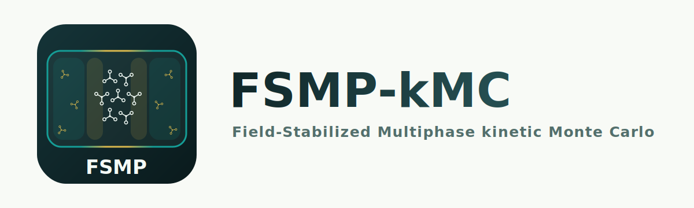

<p align="center">
  <picture>
    <source media="(prefers-color-scheme: dark)" srcset="logo/logo-dark.svg">
    <source media="(prefers-color-scheme: light)" srcset="logo/logo.svg">
    
  </picture>
</p>

# FSMP-kMC

[](https://github.com/iakobian/fsmp-kmc/actions/workflows/ci.yml)

**Field-Stabilized Multiphase kinetic Monte Carlo.** A kinetic Monte Carlo
engine for the atomistic thermodynamics of rigid molecular crystals and
two-dimensional adsorption layers.

The code simulates two coexisting phases (a crystal and an ideal-gas reservoir)
in a single elongated cell. Two imposed inhomogeneous fields, a *damping* field
and an *external* field, stabilize this coexistence over a wide range of
temperature and pressure. This makes it possible to determine the free energy,
entropy and chemical potential of dense molecular layers from the equality of
chemical potentials in the coexisting phases.

## Method

This code accompanies the following study:

> S. S. Akimenko, V. A. Gorbunov and E. A. Ustinov, *Equilibrium structure of a
> dense trimesic acid monolayer on a homogeneous solid surface: from atomistic
> simulation to thermodynamics*, *Phys. Chem. Chem. Phys.*, 2023, **25**,
> 31352–31362. <https://doi.org/10.1039/D3CP03955B>

The method was originally introduced as *Fields-supported MultiPhase kinetic
Monte Carlo (FsMP/kMC)*.

## Requirements

- A C++ compiler (clang++ is recommended).
- A numerical forcefield (potential) file. See [Forcefields](#forcefields).
- Python 3 (optional) for the post-processing scripts in `xyz_modification/`.

## Building and running

The program is built once and reads all simulation parameters from a text file
at run time. The files in `configs/` are ready-to-run examples that document
every key; use one as a template for your own system.

```bash
make
./fsmp.out configs/tma_acid_hcp.txt
```

Or compile directly, which is all the Makefile does:

```bash
clang++ -O3 fsmp.cpp -o fsmp.out
```

Paths inside a parameter file are relative to the directory the program is
started from (the examples expect the repository root), and all output files
are written there.

### Windows without a compiler

Every [release](https://github.com/IakOBiaN/fsmp-kmc/releases/latest) ships a
ready-made Windows build. Download the `...windows-x86_64.zip`, unpack it, put
the downloaded potentials into its `forcefields/` folder and run from the
command prompt:

```
fsmp.exe configs\tma_acid_hcp.txt
```

The GUI uses the same binary: copy `fsmp.exe` (and `pack.exe`) from the
release into the repository root and it is picked up automatically.

## GUI: FSMP-kMC Studio

A desktop workbench (`gui/`, PySide6) that covers the whole workflow:
molecule models, potential conversion, unit-cell optimization with a live
animation, the simulation cell, and production runs that are started
detached, with live progress, statistics plots and a trajectory viewer.
It runs natively on Windows, Linux and macOS; the setup is the same
everywhere:

```bash
python3 -m venv gui/.venv          # Windows: py -3 -m venv gui\.venv
gui/.venv/bin/pip install -e gui   # Windows: gui\.venv\Scripts\pip install -e gui
gui/.venv/bin/fsmp-gui             # Windows: gui\.venv\Scripts\fsmp-gui
```

The GUI drives the same engine binary as the command line and resolves it
in this order:

1. the `FSMP_ENGINE` environment variable (full path to a binary);
2. `fsmp.exe` or `fsmp.out` in the repository root: a release download or a
   local build;
3. `fsmp` on `PATH`;
4. on Windows only, a repository `fsmp.out` through WSL (legacy fallback).

The Run tab shows which engine it found. Closing the GUI never kills
running simulations; they are recovered from their run folders on the next
start.

## Forcefields

The intermolecular interaction is supplied as a precalculated *numerical
potential*. Ready-to-use potentials in the compact binary format (v2) are read by
the program directly; download and unpack them into the `forcefields/` folder:

[Download numerical forcefields (binary, v2)](https://1drv.ms/f/c/18917b5147a88b6c/IgC8SnvBaZORTYWhHGeVLxWQAUzqPePWJhDM3ah1dJotJos?e=5CZNiR)

The original ASCII grids of the DFT potentials are kept in a
[separate folder](https://1drv.ms/f/s!AmyLqEdRe5EYgdkXdo7VUsFQxyMmng?e=6Vi3NS).
They are only needed to repack a potential yourself, for example with different
folding or in double precision.

The run time reads only the binary format. To convert an ASCII potential (a
legacy one, or your own) use the bundled tool, then point a configuration's
potential path at the resulting `.bin` file:

```bash
make pack
./pack.out forcefields/NAME.dat forcefields/NAME.v2.bin
```

If the molecule has an n-fold rotational symmetry, pass the period in degrees as a
third argument (120 for a C3 molecule, 180 for C2) to store a single period and
shrink the grid. The stored period is the average over all symmetric periods, so
small numerical asymmetries of the potential are split evenly rather than
inherited from one arbitrary period; the tool checks the symmetry against the
data before folding.

Add `--float` to store the energies in 32-bit precision. The file is half the
size, and the rounding error in the physically relevant region (about 0.01 J/mol)
is negligible compared to the thermal energy.

## Tests

```bash
make test
```

The suite first checks the ASCII-to-binary converter on a synthetic grid
against an independent reimplementation of the packing rules, then runs the
engine on a small grid committed to the repository and compares the
deterministic initial energy of the TMA HCP crystal with a pinned value. When
the full TMA simple potential is present in `forcefields/`, the same check also
runs against the published reference energy.

## Repository layout

| Path | Description |
| --- | --- |
| `fsmp.cpp` | Program entry point: reads the parameter file, runs the simulation. |
| `program_body.cpp` | Core simulation loop. |
| `read_parameters.h` | Strict parser of the run-time parameter file. |
| `configs/` | Ready-to-run parameter files (see [Building and running](#building-and-running)). |
| `Makefile` | Build helper: the program, the converter, and the tests. |
| `includes.h` | Master list of headers pulled into `program_body.cpp`. |
| `energies_and_forces_numerical.h` | Intermolecular potential evaluated from the precalculated numerical grid (interpolation, tail correction, hard-core cutoff). |
| `interpolation.h`, `read_forcefield.h` | Grid interpolation and loading of the binary numerical potential. |
| `fields.h` | Damping field, external field, and the pressure change across the gas-solid interface. |
| `Rosenbluth_iteration.h`, `Metropolis_iteration.h` | Kinetic Monte Carlo (Rosenbluth) and Metropolis moves. |
| `StructureGenerator.h` | Generation of the initial molecular structure and unit cell. |
| `pressure_balance.h` | Mechanical equilibrium and pressure balancing. |
| `Widom_test.h` | Widom insertion check of the chemical potential. |
| `Weighted_averages.h`, `block_error.h`, `bootstrap_error.h` | Time averaging and error estimation. |
| `write_xyz_file.h` | Trajectory and configuration output (XYZ). |
| `random/` | SFMT / Mersenne Twister random number generator (by Agner Fog). |
| `models/` | Atomistic molecule models (xyz) used to draw molecules in all visual output; a configuration picks one with the `molecule_model` key. |
| `molecule_model.h` | Loader of the molecule model. |
| `forcefields/` | Numerical potential files (downloaded separately). |
| `logo/` | Project logo and GitHub preview artwork in SVG format. |
| `tools/` | `pack_forcefield.cpp`: converts an ASCII potential into the compact binary grid the run time reads. |
| `tests/` | Regression tests and their small data grid (`./tests/run_tests.sh`). |
| `xyz_modification/` | Python helper scripts for post-processing XYZ trajectories. |

## Status

This is a research code under active cleanup. It reproduces the published
results, but it is not yet packaged for general use. The program is a single
binary driven by text parameter files. Every push is checked by CI: a
warning-free build with GCC and Clang, and the regression test suite (see
[Tests](#tests)) on both Linux and native Windows. Improving and documenting
the code is ongoing.

## License

Released under the GNU General Public License v3.0. See [LICENSE](LICENSE).

This repository is a fork and continuation of the original FSMP-kMC code,
published on GitLab under its historical name
[pedl/n2_quadrupole](https://gitlab.com/pedl/n2_quadrupole). The code was
written by S. S. Akimenko and V. A. Gorbunov, under the scientific supervision
of E. A. Ustinov. The fork is maintained and further developed by
Sergey S. Akimenko. It carries the full history of the original project; see
the commit history for the changes made since the fork.

## In memory

In memory of Eugene A. Ustinov (1948–2024), whose scientific guidance shaped this
work.
