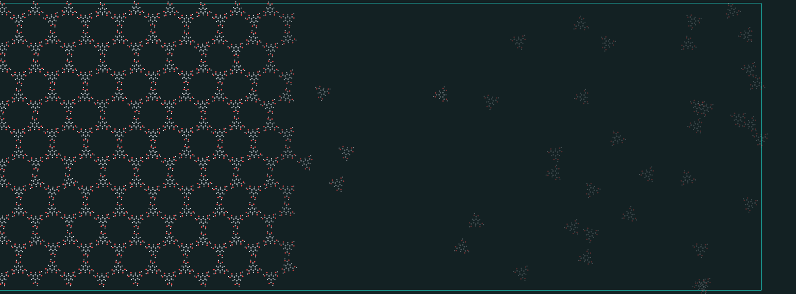
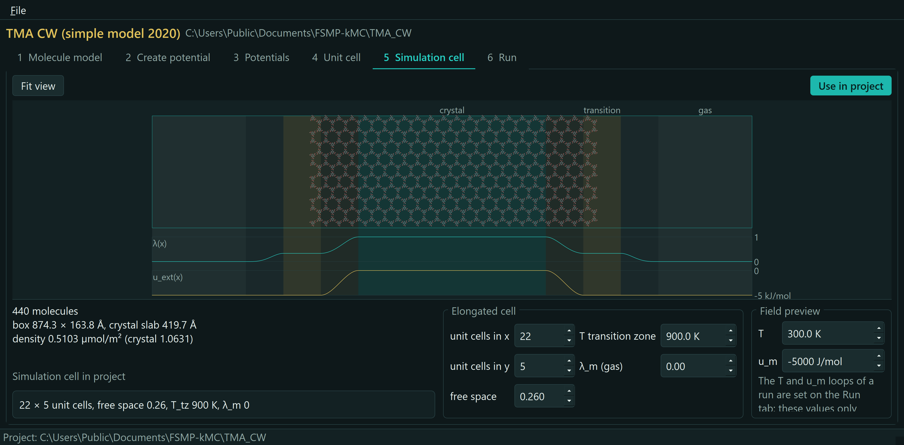
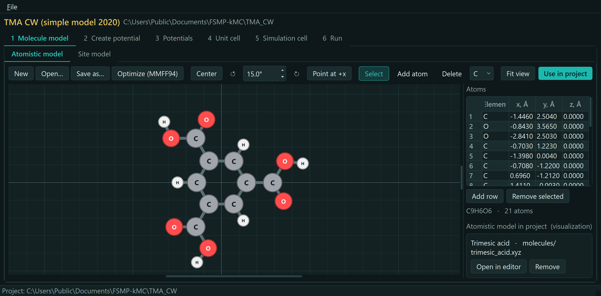
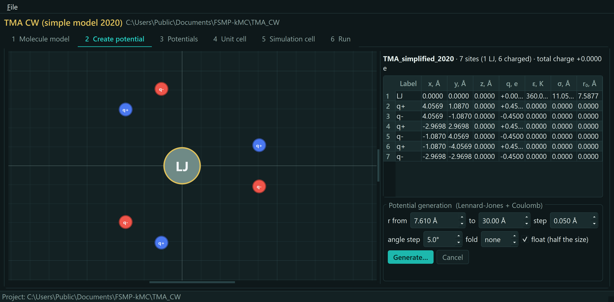
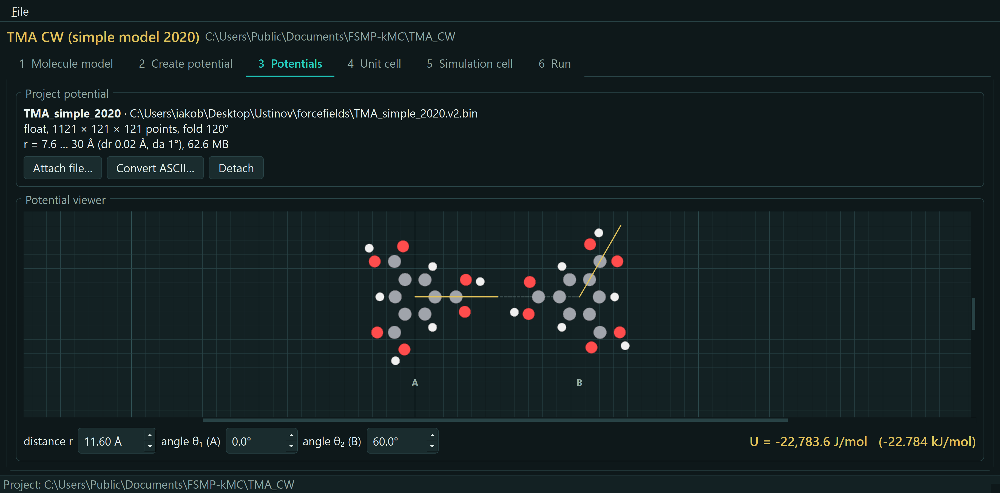
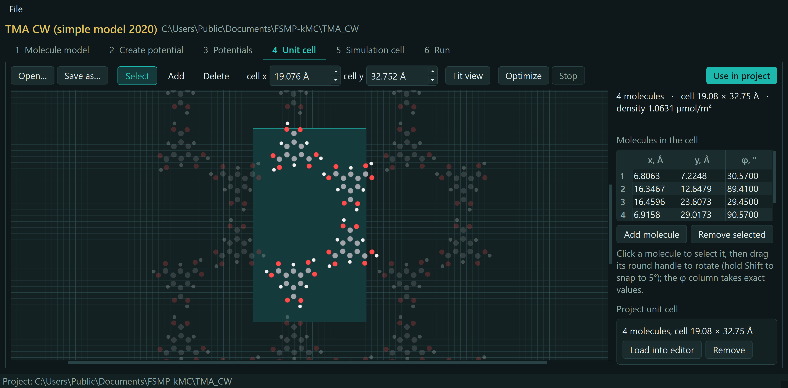
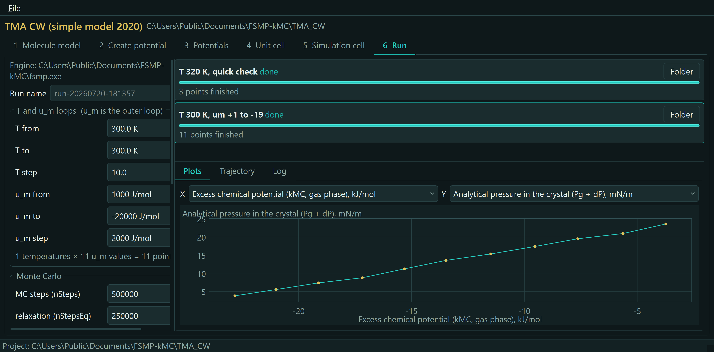
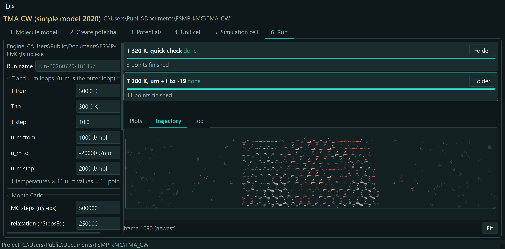

<p align="center">
  <picture>
    <source media="(prefers-color-scheme: dark)" srcset="logo/logo-dark.svg">
    <source media="(prefers-color-scheme: light)" srcset="logo/logo.svg">
    
  </picture>
</p>

# FSMP-kMC

[](https://github.com/IakOBiaN/fsmp-kmc/actions/workflows/ci.yml)
[](https://github.com/IakOBiaN/fsmp-kmc/releases/latest)
[](LICENSE)

[](https://doi.org/10.5281/zenodo.21959125)

**The free energy, entropy and chemical potential of a dense molecular
monolayer, straight from an atomistic simulation you can start by pressing
one button.**

*Field-Stabilized Multiphase kinetic Monte Carlo* keeps a crystal and its own
gas reservoir coexisting in one elongated cell, held there by two imposed
fields. Thermodynamics then follows from the equality of the chemical
potentials in the two phases: the dense layer is referred to the ideal gas
sitting in the same cell, rather than integrated along an artificial path.
Molecules are rigid bodies free to sit and turn anywhere, and they interact
through a precalculated numerical potential, so however expensively the pair
interaction was computed, the run itself pays for an interpolation.

<p align="center">
  
</p>
<p align="center"><em>A trimesic acid monolayer at its crystal-gas interface,
recorded in the FSMP-kMC Studio trajectory viewer: molecules leave and rejoin
the hydrogen-bonded lattice while the damping field fades out the ones that
cross into the ideal-gas reservoir.</em></p>

## Try it

Download the archive for your system from the
[latest release](https://github.com/IakOBiaN/fsmp-kmc/releases/latest), unpack
it, start the Studio and press **Open the demonstration**. It installs a
ready-made trimesic acid project into your documents folder and opens it on
the Run tab, where Start is the only thing left to press. Nothing has to be
downloaded first: the demonstration carries its own potential.

The same run from a source checkout, on any platform with a C++ compiler and
Python 3:

```bash
make
./fsmp.out configs/tma_quickstart_demo.txt
```

Half a minute later you have an xyz trajectory and a statistics table. The
crystal starts at `Density: 1.56  Energy: -61.45` (kJ/mol per molecule) and
holds near the published density of 1.558 µmol/m² through the field sweep,
and the statistics file carries one row per external-field value, chemical
potential included.

That run is a demonstration, not a publication setup: the bundled potential is
a coarse copy of the real one and the run is far too short to converge. The
production path is the same program with a full potential, as in
`configs/tma_acid_hcp.txt`.

## What it is for

- **Dense molecular layers, off the lattice.** Positions and orientations are
  continuous, and a molecule is a rigid body, not an occupied site. Lattice kMC
  frameworks such as [kmos](https://mhoffman.github.io/kmos/) or MonteCoffee
  answer a different question: reaction kinetics on a fixed set of adsorption
  sites.
- **Interactions from a table, not a formula.** The pair energy
  E(r, θ₁, θ₂) is precalculated on a grid, so the run inherits the accuracy of
  whatever produced it (a classical force field, a neural network, DFT, the
  built-in generator) at the cost of an interpolation.
- **Thermodynamics as the output**, not just structure: chemical potential,
  free energy, entropy and the pressure balance across the interface.
- **The whole workflow in one desktop app**, and prebuilt binaries for
  Windows, Linux and macOS. A laptop is enough; there is nothing to compile
  and no cluster to queue for.

It is not a general-purpose MD or MC package, and it does not do chemistry:
molecules stay rigid and bonds never break.

## Method

This code accompanies the following study:

> S. S. Akimenko, V. A. Gorbunov and E. A. Ustinov, *Equilibrium structure of a
> dense trimesic acid monolayer on a homogeneous solid surface: from atomistic
> simulation to thermodynamics*, *Phys. Chem. Chem. Phys.*, 2023, **25**,
> 31352–31362. <https://doi.org/10.1039/D3CP03955B>

The method was originally introduced as *Fields-supported MultiPhase kinetic
Monte Carlo (FsMP/kMC)*.

That reference, and the metadata of the software itself, are in
[CITATION.cff](CITATION.cff): GitHub's **Cite this repository** button turns
it into BibTeX or APA.

<p align="center">
  <a href="docs/screenshots/5-simulation-cell.png"></a>
</p>
<p align="center"><em>The method in one picture, as the Studio lays it out: the
elongated cell holds a crystal slab and a gas reservoir; the damping field
λ(x) and the external field u<sub>ext</sub>(x) stabilize their coexistence
over a wide range of temperature and pressure.</em></p>

## Requirements

- A C++ compiler (clang++ is recommended). Nothing else: the engine has no
  dependencies.
- A numerical potential. A small demonstration grid is committed to the
  repository and ships in every release; production potentials are a separate
  download, see [Forcefields](#forcefields).
- Python 3 for the regression tests; with numpy and matplotlib it also
  runs the optional post-processing script in `xyz_modification/`.
- For the Studio only: Python 3.10+ with PySide6, NumPy and RDKit, or simply
  the ready-made app from a [release](#ready-made-builds-no-compiler-no-python).

## Building and running

The program is built once and reads all simulation parameters from a text file
at run time. The files in `configs/` are ready-to-run examples that document
every key; use one as a template for your own system.

```bash
make
./fsmp.out configs/tma_quickstart_demo.txt
```

That second line is the quickstart from [Try it](#try-it): it runs on the
small demonstration potential committed to the repository, so it works right
after a clone, and the same run is a ready-to-open Studio project in
`samples/projects/TMA_quickstart`. For real numbers, use a full potential
(see [Forcefields](#forcefields)) and a configuration like
`configs/tma_acid_hcp.txt`.

Or compile directly, which is all the Makefile does:

```bash
clang++ -O3 fsmp.cpp -o fsmp.out
```

On Windows, `make windows` builds native static `fsmp.exe` and `pack.exe`;
it needs a MinGW g++ on `PATH`
([w64devkit](https://github.com/skeeto/w64devkit) is a portable
single-archive toolchain; MSYS2 works too). With w64devkit unpacked to
`C:\w64devkit` (or pointed to by `W64DEVKIT`), `build.cmd` wraps it all
without touching `PATH`: `build` compiles the engine, `build test` runs
the test suite, `build bundle` assembles the release bundle.

Paths inside a parameter file are relative to the directory the program is
started from (the examples expect the repository root), and all output files
are written there.

### Ready-made builds (no compiler, no Python)

Every [release](https://github.com/IakOBiaN/fsmp-kmc/releases/latest) ships a
self-contained bundle per platform (Windows, Linux, macOS): the FSMP-kMC
Studio desktop app, the engine and converter binaries, example configs and
the bundled molecule models, unit cells and demonstration potential. Download
the archive for your system, unpack it and start the Studio
(`FSMP-kMC Studio.exe` on Windows), or run the engine from the command line:

```powershell
.\fsmp.exe configs\tma_quickstart_demo.txt
```

The same release also carries a `-cli` archive per platform: the engine, the
converter and the example data without the Studio, a few megabytes instead of
a hundred, for running from the command line or on a cluster. Both archives
carry a `BUILD_INFO.txt` naming the version, the platform and the commit they
were built from.

Working with a release does not require the source code. The binaries are
not code-signed (usual for academic software): on the first launch of a
downloaded copy Windows SmartScreen may warn about an unrecognized app
(More info → Run anyway). Windows Defender may go further and quarantine
`FSMP-kMC Studio.exe` as a false positive — the PyInstaller runtime that
packs the app is a shape antivirus heuristics distrust, not actual malware;
restore it from Windows Security → Protection history (and add the folder to
Exclusions before re-extracting), or verify the file yourself on VirusTotal.
On macOS 15 and newer the first launch is
blocked outright: allow the app under System Settings → Privacy & Security
→ Open Anyway (on older macOS right-click → Open is enough), or unpack the
archive in Terminal with `tar -xzf`, which never sets the quarantine flag
in the first place. Every
release also carries a `SHA256SUMS.txt`; verify a download with
`sha256sum -c --ignore-missing SHA256SUMS.txt`. The Linux
bundle runs on Ubuntu 22.04 or newer (glibc 2.35+); the engine binary
itself is static and runs anywhere. For development, the same layout works inside
the repository: `fsmp.exe` or `fsmp.out` in the repository root is picked
up by the GUI automatically.

## GUI: FSMP-kMC Studio

A desktop workbench (`gui/`, PySide6) that covers the whole workflow:
molecule models (with MMFF94 geometry optimization of a hand-built
molecule), potential generation and conversion, unit-cell optimization with
a live animation, the simulation cell, and production runs that are started
detached, with live progress, statistics plots and a trajectory viewer.

Its start page opens with **Open the demonstration**: one click installs the
quickstart project (with its own potential, so nothing is downloaded) into
your documents folder and lands on the Run tab, where Start is the only
thing left to press.

|  |  |
| :---: | :---: |
| *1 · Molecule model — the atomistic molecule and the site model* | *2 · Create potential — sweep the model into a numerical potential* |
|  |  |
| *3 · Potentials — probe the attached grid at any dimer geometry* | *4 · Unit cell — build and optimize the crystal cell* |
|  |  |
| *6 · Run — detached production runs, live statistics plots* | *6 · Run — the trajectory viewer on the two-phase cell* |

<sub>Tab 5, the simulation cell, is the picture in
[Method](#method); the animation at the top of this README is tab 6, the
trajectory viewer, zoomed to a crystal-gas interface over a sweep of the
external field. All stills and the animation are rendered straight from the
application, on the bundled sample project.</sub>

Every release ships the Studio as a ready-made app (see
[Ready-made builds](#ready-made-builds-no-compiler-no-python)); the
following runs it from source. It runs natively on Windows, Linux and
macOS; the setup is the same everywhere:

```bash
python3 -m venv gui/.venv          # Windows: py -3 -m venv gui\.venv
gui/.venv/bin/pip install -e gui   # Windows: gui\.venv\Scripts\pip install -e gui
gui/.venv/bin/fsmp-gui             # Windows: gui\.venv\Scripts\fsmp-gui
```

The GUI drives the same engine binary as the command line and resolves it
in this order:

1. the `FSMP_ENGINE` environment variable (full path to a binary);
2. `fsmp.exe` or `fsmp.out` in the repository root: a release download or a
   local build;
3. `fsmp` on `PATH`.

The Run tab shows which engine it found. Closing the GUI never kills
running simulations; they are recovered from their run folders on the next
start.

## Forcefields

The intermolecular interaction is supplied as a precalculated *numerical
potential*. Ready-to-use potentials in the compact binary format (v2) are read by
the program directly; download and unpack them into the `forcefields/` folder:

[**Numerical pair potentials for FSMP-kMC**](https://doi.org/10.5281/zenodo.21959125) (Zenodo, 10.5281/zenodo.21959125)

The dataset holds two independent sets of grids for the same four acids, 66 MB
to 2.2 GB each, under CC BY 4.0. The classical set was computed with the
DREIDING force field and its explicit hydrogen-bond term, on molecules whose
partial charges come from a DFT calculation; the names record both, `q` for
the charge calculation and `Dhb` for the hydrogen-bond distance. The second
set was computed with the AIMNet2 machine-learned potential and reaches out
to 30 Å. Trimesic acid also comes as the simplified analytic model. The two
sets are different descriptions rather than a correction of one by the other.
The dataset's own README documents every grid and the binary format down to
the byte offsets. The DOI above always resolves to the latest version of the
record, and citing it is how these potentials should be credited.

The original ASCII grids of these potentials are kept in a
[separate cloud folder](https://1drv.ms/f/s!AmyLqEdRe5EYgdkXdo7VUsFQxyMmng?e=6Vi3NS).
They are only needed to repack a potential yourself, for example with different
folding or in double precision.

The run time reads only the binary format. To convert an ASCII potential (a
legacy one, or your own) use the bundled tool, then point a configuration's
potential path at the resulting `.bin` file:

```bash
make pack
./pack.out forcefields/NAME.dat forcefields/NAME.v2.bin
```

If the molecule has an n-fold rotational symmetry, pass the period in degrees as a
third argument (120 for a C3 molecule, 180 for C2) to store a single period and
shrink the grid. The stored period is the average over all symmetric periods, so
small numerical asymmetries of the potential are split evenly rather than
inherited from one arbitrary period; the tool checks the symmetry against the
data before folding.

Add `--float` to store the energies in 32-bit precision. The file is half the
size, and the rounding error in the physically relevant region (about 0.01 J/mol)
is negligible compared to the thermal energy.

### Generating a potential in the Studio

The Studio can also build a numerical potential by itself, on the *Create
potential* tab. A coarse-grained site model is swept with Lennard-Jones and
Coulomb interactions between its sites; an atomistic molecule is scored with
the MMFF94 classical force field (typed by RDKit), so a freshly drawn and
optimized molecule turns into a working potential in seconds, with no
external data.

MMFF94 is a demonstration-grade backend with honest physics: hydrogen-bonded
assemblies hold together, the tails behave correctly out to the grid cutoff,
and for trimesic acid the dimer well lands at the same arrangement as the
published grid. It binds that dimer far more weakly, -40.0 kJ/mol against
-78.4, so absolute cohesion energies and transition temperatures shift. For
production numbers, compute the grid with your own method and attach the
packed file: the engine reads any v2 binary regardless of its origin.

### Generating a potential with a neural network

The repository also carries `nnpot`, a separate command-line tool that builds
the same kind of grid with a machine-learned potential instead of a classical
force field. The three descriptions this project can put on the same trimesic
acid dimer place its hydrogen bond 38 kJ/mol apart, and that spread propagates
straight into the cohesion energy and the transition temperatures. A production
grid takes about forty minutes on a laptop GPU.

It is deliberately not part of the Studio or of the release bundles: PyTorch
with CUDA is four gigabytes against the sixty megabytes of a bundle. It is
installed on its own and produces an ordinary v2 file, attached to a project
like any other potential. See [nnpot/README.md](nnpot/README.md).

## Tests

```bash
make test
```

The suite first checks the ASCII-to-binary converter on a synthetic grid
against an independent reimplementation of the packing rules, then runs the
engine and the unit-cell optimizer on the small demonstration grid committed
to the repository and compares the deterministic initial energy of the TMA
HCP crystal with a pinned value. When the full TMA simple potential is
present in `forcefields/`, the same check also runs against the published
reference energy. The last block runs the quickstart configuration exactly as
it ships, so the first thing a new user tries is covered by the suite too.

## Repository layout

| Path | Description |
| --- | --- |
| `fsmp.cpp` | Program entry point: reads the parameter file, runs the simulation. |
| `program_body.cpp` | Core simulation loop. |
| `read_parameters.h` | Strict parser of the run-time parameter file. |
| `cell_file.h` | Reader and writer of the `.cell` unit cell files: what a configuration's `structure` key points at, and what the optimizer leaves behind. |
| `configs/` | Ready-to-run parameter files (see [Building and running](#building-and-running)). |
| `Makefile` | Build helper: the program, the converter, and the tests. |
| `includes.h` | Master list of headers pulled into `program_body.cpp`. |
| `version.h` | The single source of the project version (`--version`, the Studio, bundle names). |
| `energies_and_forces_numerical.h` | Intermolecular potential evaluated from the precalculated numerical grid (interpolation, tail correction, hard-core cutoff). |
| `interpolation.h`, `read_forcefield.h` | Grid interpolation and loading of the binary numerical potential. |
| `fields.h` | Damping field, external field, and the pressure change across the gas-solid interface. |
| `Rosenbluth_iteration.h`, `Metropolis_iteration.h` | Kinetic Monte Carlo (Rosenbluth) and Metropolis moves. |
| `StructureGenerator.h` | Tiling of the unit cell into the elongated simulation box, and the unit cell optimizer. |
| `pressure_balance.h` | Mechanical equilibrium and pressure balancing. |
| `Widom_test.h` | Widom insertion check of the chemical potential. |
| `Weighted_averages.h` | Time averaging of the run statistics. |
| `write_xyz_file.h` | Trajectory and configuration output (XYZ). |
| `random/` | SFMT random number generator (by Agner Fog). |
| `samples/` | Example data shipped in every bundle: `models/` (atomistic `.xyz` and site `.site`, picked by a configuration's `molecule_model` key and drawn in all visual output), `cells/` (reference unit cells, what a configuration's `structure` key points at), `potentials/` (the small demonstration grid the quickstart runs on), and `projects/` (ready-to-open Studio projects: `TMA_quickstart` needs no download, the others reproduce the paper). |
| `molecule_model.h` | Loader of the molecule model. |
| `forcefields/` | Numerical potential files (downloaded separately). |
| `logo/` | Project logo, GitHub preview artwork and the graphical abstract. |
| `docs/` | README screenshots, rendered straight from the app. |
| `tools/` | `pack_forcefield.cpp` converts an ASCII potential into the compact binary grid; `make_bundle.py` assembles the release archives (CI and `make bundle`); `fsmp.rc`/`pack.rc` are the version resources of the Windows binaries. |
| `tests/` | Regression tests (`python3 tests/run_tests.py`); they run on the demonstration grid in `samples/potentials/`. |
| `nnpot/` | Standalone tool that computes a pair potential with a machine-learned model (AIMNet2); installed separately, never part of the Studio or the bundles (see [nnpot/README.md](nnpot/README.md)). |
| `xyz_modification/` | Post-processing: a time-averaged density map from an XYZ trajectory. |

## Status

Stable. The engine reproduces the published results, and every release ships
ready-made archives for Windows, Linux and macOS (see
[Ready-made builds](#ready-made-builds-no-compiler-no-python)); the program
itself is a single binary driven by text parameter files, and a parameter it
cannot run with stops it at once, naming the file and the line. Every push is
checked by CI: a warning-free build with GCC and Clang, the engine
regression suite (see [Tests](#tests)) on Linux, macOS and native Windows,
and the Studio's own GUI test suite. A release additionally self-tests every
assembled bundle and refuses to publish one that lost a file. Development
continues with bug fixes and small features; what changed in each release is
in [CHANGELOG.md](CHANGELOG.md).

## Contributing

Bug reports, questions and patches are welcome:
[CONTRIBUTING.md](CONTRIBUTING.md) covers building, the test suites and the
pinned energies a patch has to keep intact. A result that looks physically
wrong has [its own issue template](.github/ISSUE_TEMPLATE/unexpected_physics.yml),
separate from ordinary bugs. See also the
[code of conduct](CODE_OF_CONDUCT.md), the
[security policy](SECURITY.md) and the [roadmap](ROADMAP.md).

## License

Released under the GNU General Public License v3.0. See [LICENSE](LICENSE).

Every release archive carries that license, a
[THIRD_PARTY_NOTICES.md](THIRD_PARTY_NOTICES.md) and a `licenses/` folder
with the terms of everything bundled with it: Qt through PySide6 under the
LGPL v3.0, the Python runtime, NumPy, RDKit, Pillow, PyYAML, the PyInstaller
bootloader, and the SFMT random number generator inside the engine itself.
The bundle is not packaged unless all of them are present.

This repository is a fork and continuation of the original FSMP-kMC code,
published on GitLab under its historical name
[pedl/n2_quadrupole](https://gitlab.com/pedl/n2_quadrupole). The code was
written by S. S. Akimenko and V. A. Gorbunov, under the scientific supervision
of E. A. Ustinov. The fork is maintained and further developed by
Sergey S. Akimenko. It carries the full history of the original project; see
the commit history for the changes made since the fork.

## In memory

In memory of Eugene A. Ustinov (1948–2024), whose scientific guidance shaped this
work.
